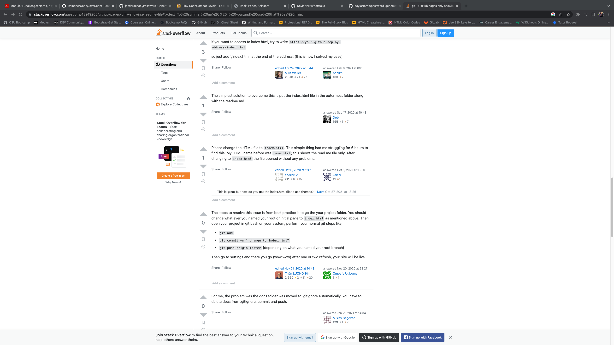

# Password Generator

## Description
This application was made to easily make a random password, based upon certain requirements that are chosen by the user via prompts. These passwords are stronger and provide better security than your basic pet name and numbers type of passwords. We wanted to allow the user to customize the password by allowing them to choose the length, lowercase, uppercase, numbers, or special characters depending on their individual needs. The generator will also send an alert if the length is out of range, or if the user does not pick at least one character type.

## Installation

N/A

## Usage

To begin, you click the red "generate password" button. If an incorrect length is entered it will give an alert and start you over. The same will happen if at least one character type is not chosen. To select your character types, you would click "ok". If you do not wish to have a certain character type in your password, you would click "cancel".

 https://kaylanorris.github.io/password-generator/

## License

Please refer to the license in the REPO.